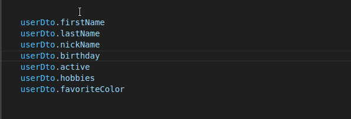

# Introduction

DTO Classes is a TypeScript library for parsing, validating and serializing, designed primarily for data transfer objects in HTTP JSON APIs.

It gives you the following, a bundle I've found missing in the TypeScript/Node ecosystem:
- Class-based schemas that parse/validate and serialize internal objects to JSON
- Fields attached to schemas as class properties
- Static types available by default without an additional `infer` call
- Custom validation by adding class methods to a schema class
- Constraints defined in a single options interface, not by chaining methods
- Async by default to play nice with ORMs within schemas

Example:

```typescript
import { Format } from "dto-classes/decorators";
import { DTObject } from "dto-classes/dt-object";
import { ArrayField } from "dto-classes/array-field";
import { StringField } from "dto-classes/string-field";
import { DateTimeField } from "dto-classes/date-time-field";


class UserDto extends DTObject {
    firstName = StringField.bind()
    lastName = StringField.bind()
    nickName = StringField.bind({ required: false })
    birthday = DateTimeField.bind()
    active = BooleanField.bind({ default: true })
    hobbies = ArrayField.bind({ items: StringField.bind() })
    favoriteColor = StringField.bind({ allowNull: true })
}

const userDto = await UserDto.parse({
    firstName: "Michael",
    lastName: "Scott",
    birthday: '1962-08-16',
    hobbies: ["Comedy", "Paper"],
    favoriteColor: "Red"
});
```

VS Code:




# Installation

TypeScript 4.5+ is required. 

Run: `npm install dto-classes`

You'll get more accurate type hints with strict null checks in your `tsconfig.json`:
```jsonc
{
  "compilerOptions": {
    // ...
    "strictNullChecks": true
    // ...
}
```

# Basic Usage

## Parsing & Validating

Let's start by defining some schema classes. Extend the `DTObject` class and define its fields:

```typescript
import { DTObject, StringField, DateTimeField } from 'dto-classes';

class DirectorDto extends DTObject {
    name = StringField.bind()
}

class MovieDto extends DTObject {
    title = StringField.bind()
    releaseDate = DateTimeField.bind()
    director = DirectorDto.bind(),
    genre = StringField.bind({required: false})
}
```

There's some incoming data:
```typescript
const data = {
    "title": "The Departed",
    "releaseDate": '2006-10-06',
    "director": {"name": "Martin Scorsese"}
}
```

We can parse and validate the data by calling the static method `parse(data)` which will return a newly created DTO instance:

```typescript
const movieDto = await MovieDto.parse(data);
```

If it succeeds, it will return a strongly typed instance of the class.

If it fails, it will raise a validation error:

```typescript
import { ValidationError } from "dto-classes";

try {
    const movieDto = await MovieDto.parse(data);
} catch (error) {
    if (error instanceof ValidationError) {
        // 
    }
}
```

## Formatting

You can also format internal data types to JSON data that can be returned in an HTTP response.

A common example is model instances originating from an ORM:

```typescript
const movie = await repo.fetchMovie(45).join('director')
const jsonData = await MovieDto.format(movie);
return HttpResponse(jsonData);
```

Special types, like JavaScript's Date object, will be converted to JSON compatible output:
```json
{
    "title": "The Departed",
    "releaseDate": "2006-10-06",
    "director": {"name": "Martin Scorsese"}
}
```

Any internal properties not specified will be ommitted from the formatted output.

# Fields

Fields handle converting between primitive values and internal datatypes. They also deal with validating input values. They are attached to a `DTObject` using the `bind(options)` static method. 

All field types accept some core options:

```typescript
interface BaseFieldOptions {
    required?: boolean;  
    allowNull?: boolean;
    readOnly?: boolean;  
    writeOnly?: boolean; 
    default?: any;
    partial?: boolean;
    formatSource?: string;
}
```

| Option      | Description                         | Default |
| ----------- | ---------------------------------- |  ------- |
| required    | Whether an input value is required | true |
| allowNull   | Whether null input values are allowed | false |
| readOnly    | If true, any input value is ignored during parsing, but is included in the output format | false |
| writeOnly   | If true, the field's value is excluded from the formatted output, but is included in parsing | false |
| default     | The default value to use during parsing if none is present in the input | n/a |
| formatSource  | The name of the attribute that will be used to populate the field, if different from the formatted field name name | n/a  |

## StringField

- Parses input to strings. Coerces numbers, other types invalid. 
- Formats all value types to strings.

```typescript
interface StringOptions extends BaseFieldOptions {
    allowBlank?: boolean;
    trimWhitespace?: boolean;
    maxLength?: number;
    minLength?: number;
    pattern?: RegExp,
    format?: 'email' | 'url'
}
```
| Option      | Description                         | Default |
| ----------- | ---------------------------------- |  ------- |
| allowBlank    | If set to true then the empty string should be considered a valid value. If set to false then the empty string is considered invalid and will raise a validation error. | false |
| trimWhitespace   | If set to true then leading and trailing whitespace is trimmed.  | true |
| maxLength    | Validates that the input contains no more than this number of characters. | n/a |
| minLength   | Validates that the input contains no fewer than this number of characters. | n/a |
| pattern     | A `Regex` that the input must match or a ValidationError will be thrown. | n/a |
| format  | A predefined format that the input must conform to or a ValidationError will be thrown. Supported values: `email`, `url`. | n/a  |

## BooleanField

- Parses input to booleans. Coerces certain bool-y strings. Other types invalid.
- Formats values to booleans.

Truthy inputs:
```typescript
['t', 'T', 'y', 'Y', 'yes', 'Yes', 'YES', 'true', 'True', 'TRUE', 'on', 'On', 'ON', '1', 1, true]
```

Falsey inputs:
```typescript
['f', 'F', 'n', 'N', 'no', 'No', 'NO', 'false', 'False', 'FALSE', 'off', 'Off', 'OFF', '0', 0, 0.0, false]
```

## NumberField

- Parses input to numbers. Coerces numeric strings. Other types invalid.
- Formats values to numbers.

```typescript
interface NumberOptions extends BaseFieldOptions {
    maxValue?: number;
    minValue?: number;
}
```

| Option      | Description                         | Default |
| ----------- | ---------------------------------- |  ------- |
| maxValue   | Validate that the number provided is no greater than this value. | n/a |
| minValue   | Validate that the number provided is no less than this value. | n/a |


## DateTimeField

- Parses input to `Date` instances. Coercing date-ish strings using `Date.parse()`. 
- Formats values to strings with `Date.toISOString()`.

```typescript
interface DateTimeFieldOptions extends BaseFieldOptions {
    maxDate?: Date;
    minDate?: Date;
}
```

| Option      | Description                                                  | Default |
| ----------- | ---------------------------------------------------------------- | --- |
| maxDate   | Validate that the date provided is no later than this date. | n/a |
| minDate   | Validate that the date provided is no earlier than this date.    | n/a |


## ArrayField

- Parses and formats a list of fields or nested objects.

```typescript
interface ArrayOptions extends BaseFieldOptions {
    items: BaseField | DTObject;
    maxLength?: number;
    minLength?: number;
}
```

| Option      | Description                                                  | Default |
| ----------- | ---------------------------------------------------------------- | --- |
| items   | A bound field or object | n/a |
| maxLength   | Validates that the array contains no fewer than this number of elements. | n/a |
| minLength   | Validates that the list contains no more than this number of elements.    | n/a |


Examples:

```typescript
class ActionDto extends DTObject {
    name = String.bind()
    timestamp = DateTimeField.bind()
}

class UserDto extends DTObject {
    actions = ArrayField.bind({ items: ActionDto.bind() })
    emailAddresses = ArrayField.bind({ items: StringField.bind() })
}
```

# Error Handling

If parsing fails for any reason -- the input data could not be parsed or a validation constraint failed -- a `ValidationError` is thrown.

The error can be inspected:

```typescript
class ValidationError extends Error {
  issues: ValidationIssue[];
}

interface ValidationIssue {
    path: string[]; // path to the field that raised the error
    message: string; // English description of the problem
}
```

Example:
```typescript
import { ValidationError } from "dto-classes";


class DirectorDto extends DTObject {
    name = StringField.bind()
}

class MovieDto extends DTObject {
    title = StringField.bind()
    director = DirectorDto.bind(),
}

try {
    const movieDto = await MovieDto.parse({
        title: 'Clifford', 
        director: {}
    });
} catch (error) {
    if (error instanceof ValidationError) {
        console.log(error.issues);
        /* [
            {
                "path": ["director", "name"],
                "message": "This field is required"
            }
        ] */
    }
}

```

# Custom Parsing/Validation

For custom validation and rules that must examine the whole object, methods can be added to the `DTObject` class.

To run the logic after parsing, use the `@AfterParse` decorator.

```typescript
import { AfterParse, BeforeParse, ValidationError } from "dto-classes";

class MovieDto extends DTObject {
    title = StringField.bind()
    director = DirectorDto.bind()

    @AfterParse()
    rejectBadTitles() {
        if (this.title == 'Yet Another Superhero Movie') {
            throw new ValidationError('No thanks');
        }
    }
}
```

The method can modify the object as well:

```typescript
import { AfterParse, BeforeParse, ValidationError } from "dto-classes";

class MovieDto extends DTObject {
    title = StringField.bind()
    director = DirectorDto.bind()

    @AfterParse()
    makeTitleExciting() {
        this.title = this.title + '!!';
    }
}
```

# Custom Formatting

Override the static `format` method to apply custom formatting.

```typescript
import { AfterParse, BeforeParse, ValidationError } from "dto-classes";

class MovieDto extends DTObject {
    title = StringField.bind()
    director = DirectorDto.bind()

    static format(value: any) {
        const formatted = super.format(value);
        formatted['genre'] = formatted['director']['name'].includes("Mike Judge") ? 'comedy' : 'drama';
        return formatted;
    }
}
```

# Less Common Scenarios

## Recursive Objects

## Standalone Fields

# NestJS

Coming soon...
