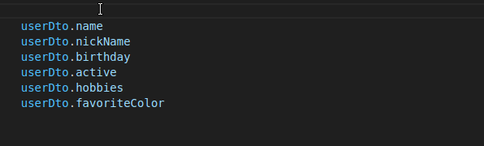

# Introduction

DTO Classes is a TypeScript library for parsing, validating and serializing, designed primarily for data transfer objects in HTTP JSON APIs.

It gives you the following, a bundle I've found missing in the TypeScript/Node ecosystem:
- Class-based schemas that parse/validate and serialize internal objects to JSON
- Fields attached to schemas as class properties
- Static types available by default without an additional `infer` call
- Custom validation by adding class methods to a schema class
- Constraints defined in a single options interface, not by chaining methods
- Async by default to play nice with ORMs within schemas

Example:

```typescript
import { Format } from "dto-classes/decorators";
import { DTObject } from "dto-classes/dt-object";
import { ArrayField } from "dto-classes/array-field";
import { StringField } from "dto-classes/string-field";
import { DateTimeField } from "dto-classes/date-time-field";


class UserDto extends DTObject {
    firstName = StringField.bind()
    lastName = StringField.bind()
    nickName = StringField.bind({ required: false })
    birthday = DateTimeField.bind()
    active = BooleanField.bind({ default: true })
    hobbies = ArrayField.bind({ items: StringField.bind() })
    favoriteColor = StringField.bind({ allowNull: true })
}

const userDto = await UserDto.parseNew({
    firstName: "Michael",
    lastName: "Scott",
    birthday: '1962-08-16',
    hobbies: ["Comedy", "Paper"],
    favoriteColor: "Red"
});
```

VS Code:




# Installation

TypeScript 4.5+ is required. 

Run: `npm install dto-classes`

You'll get more accurate type hints with strict null checks in your `tsconfig.json`:
```jsonc
{
  "compilerOptions": {
    // ...
    "strictNullChecks": true
    // ...
}
```
# Basic Usage

## Parsing & Validating

Let's start by defining some schema classes. Extend the `DTObject` class and define its fields:

```typescript
import { DTObject, StringField, DateTimeField } from 'dto-classes';

class DirectorDto extends DTObject {
    name = StringField.bind()
}

class MovieDto extends DTObject {
    title = StringField.bind()
    releaseDate = DateTimeField.bind()
    director = ArtistDto.bind(),
    genre = StringField.bind({required: false})
}
```

There's some incoming data:
```typescript
const data = {
    "title": "The Departed",
    "releaseDate": '2006-10-06',
    "director": {"name": "Martin Scorsese"}
}
```

We can parse and validate the data by calling the static method `parseNew(data)` which will return a newly created DTO instance:

```typescript
const movieDto = await MovieDto.parseNew(data);
```

If it succeeds, it will return a strongly typed instance of the class.

If it fails, it will raise a validation error:

```typescript
import { ValidationError } from "dto-classes";

try {
    const movieDto = await MovieDto.parseNew(data);
} catch (error) {
    if (error instanceof ValidationError) {
        // 
    }
}
```

## Formatting

You can also format internal data types to JSON data that can be returned in an HTTP response.

A common example is model instances originating from an ORM:

```typescript
const movie = await repo.fetchMovie(45).join('director')
const jsonData = await MovieDto.format(movie);
return HttpResponse(jsonData);
```

Special types, like JavaScript's Date object, will be converted to JSON compatible output:
```json
{
    "title": "The Departed",
    "releaseDate": "2006-10-06",
    "director": {"name": "Martin Scorsese"}
}
```

Importantly, any internal properties not specified will be ommitted from the formatted output.

# Fields

Field handle converting between primitive values and internal datatypes. They also deal with validating input values. They are attached to a `DTObject` using the `bind(options)` static method. 

All field types accept some core options:

```typescript
interface BaseFieldOptions {
    required?: boolean;  // Whether an input value is required; default is false
    allowNull?: boolean; // Whether null input values are allowed; default is false
    readOnly?: boolean;  // If true, the field is included in the format() output, but ignored when parsing; default is false
    writeOnly?: boolean; // If true, the field is parsed/validated, but excluded in the format() output
    default?: any;
    partial?: boolean;
    formatSource?: string | null; // The property name on the internal object to pull when formatting; only use if different from the DTO field name
}
```

# Error Handling

# Customization

## Validation

## Formatting

## Fields

# Less Common Scenarios

## Recursive Objects

## Standalone Fields

# NestJS
